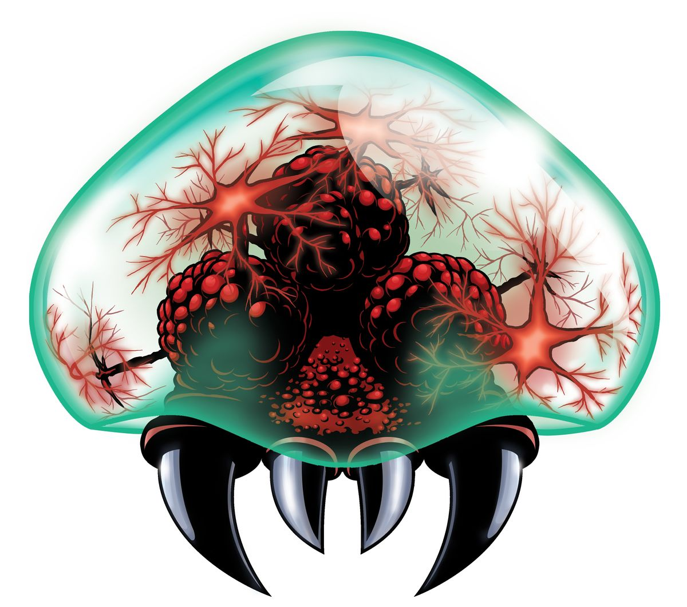
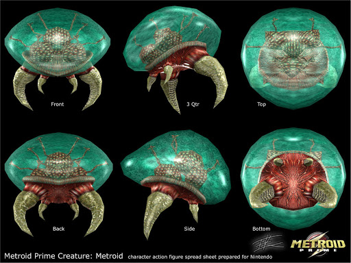
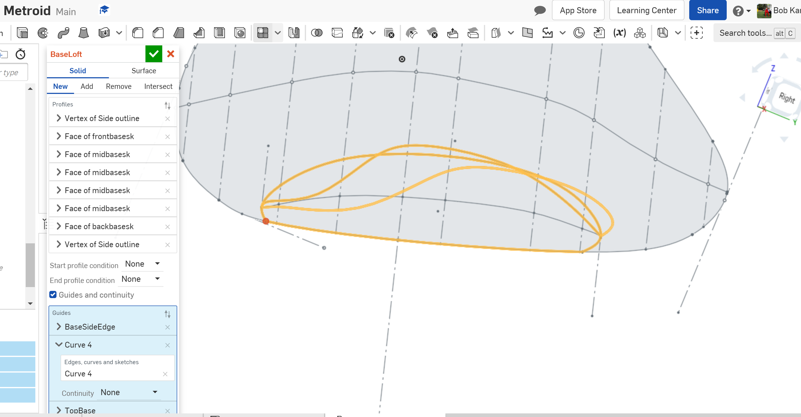
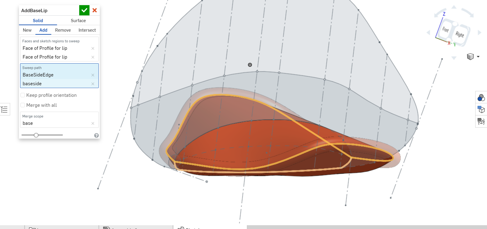
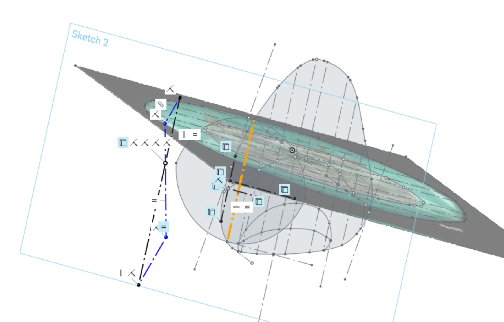
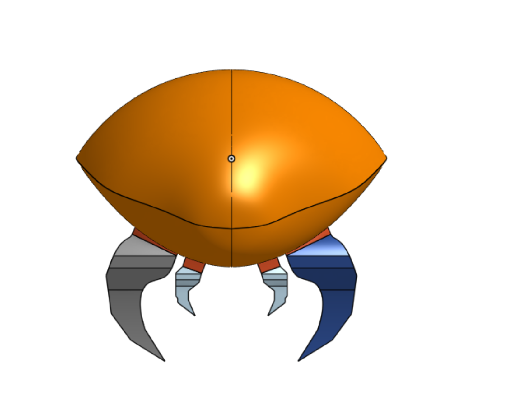
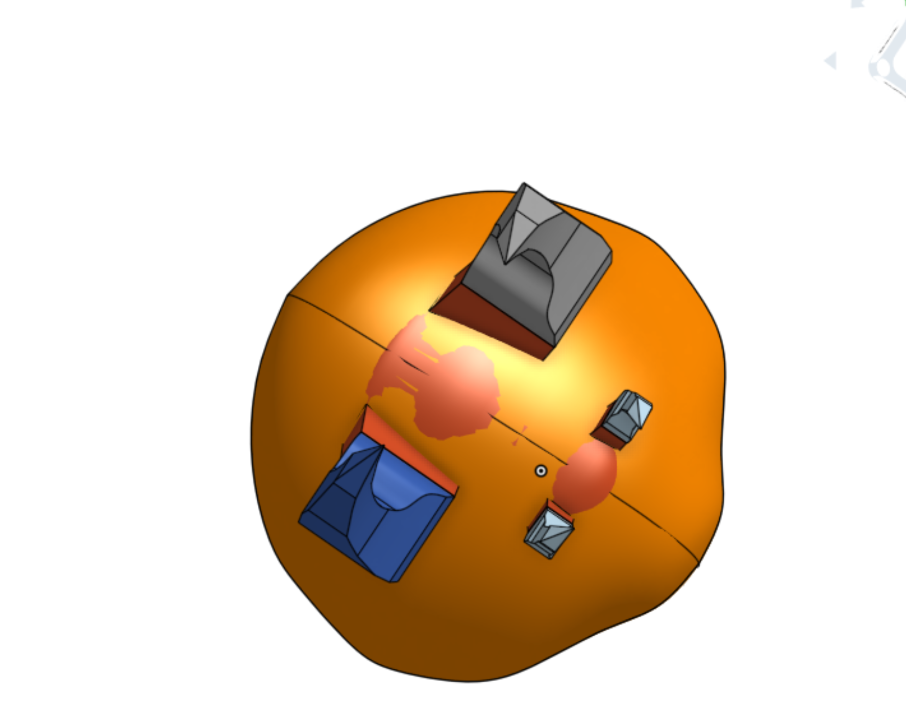

# Metroid
Goal: Make a Metroid in Onshape

[*Link To The Onshape*](https://cvilleschools.onshape.com/documents/ee5223fdaef46bd1839543ff/w/fd398ba0772dd120d6f260a6/e/cab88515b417c9bb29a40312)
## Table of contents
- [Planning](#Planning)
- [Picture_Sketching](#Picture_Sketching)
- [Base](#Base)
- [Talons](#Talons)
- [Orbs](#Orbs)
- [Jelly_Shell](#Jelly_Shell)

### Planning
### Picture_Sketching
I found this multishot of a metroid from metroid prime

### Base

note: I had written a lot on here, but it appears that I'd forgotten to save my work so it's all mostly gone :(

I started by tracing out what 2D dimmensions the reference pics were giving me. At first, I figured I could use exactly that to form elipses that fit into them to be used as loft planes. But i then realized i just needed to figure out the general shape of the solid, then use that as a loft plane. For the base, I thought it looked almost like a saddle, so i used a spline with a flatter top to sorta form it.

Had some mishaps with extend entities. just had to undo them and manually extend them.

Came back to the base after creating the shell bc it doesn't line up with the shell. Using composite curves on the outlines in order to have them all meet at the end vertexes.

And ig lofts ***really*** don't like kinks in a guide

see? ill just add a sketch fillet to that
oh boy that didn't work

oh well we can come back to it.

I don't think we'll be able to fix that, but let's add a lip around the edge with a sweep!

very nice! i think this will also help the shell to fit better later on.

So Currently, I've been trying to update the base so that it would match what i had already done on one side. I gave up with feature mirror, and just chopped the base in half, removed the un-updated one, part mirror new the half base along with the talons, and unioned the base back together. Jeez I spent too much time on that.

### Talons
### Orbs
### Jelly_Shell

Final frontier lets do this

The game plan is to:
1. Use same planes fron the base and do basically the same thing (but with a more bulbous shape)
2. Use the shell command to make it hollow
3. use boolean to solve any intersections

Looking back, I feel like I should do it another way, but I'm running out of time and I know how to do this

Ok. how should I construct the shape?

I decided on two separate arcs that are tangent at the top and bottom(and then mirror about the vertical center line.

All of the midplanes use this shape, so that the number of verticies is the same at 4.

At one end, the side continues beyond the top, so I just made the lengths proportional to the next one over

How did i do it? Using the line intersection theorem to create similar triangles, and set the lengths equal to the lines constructing the main sketch.

My 3D fit spline didn't work because I had tried to make it a closed spline. making half of it and then mirroring it as before fixed it

Finally made a shell so it actually looks like a meteriod!

*Typo was unintentional, but i like it so it's intentional now >:)*

Just one problem...

It doesn't line up with the base very well...

Well I tried to update the base to make it look right but to no avail

I DID figure out how to shell the object, and it's really stupid

It didn't like shelling the whole thing to make it hollow, so what i did is used fill to make a surface with the closed set of splines surrounding the shell, split the shell in two, and now it'll let me remove those faces and shell it :D

Then to recombine, i can just use bool union

now that I'm thinking about it, we could use a sweep to make the lip that you can see on the base, instead of trying to fillet it.

imma go do that^

It works! this gives me an Idea...

anyway, back to the shell.

So splitting it so that both parts could be shelled took some trial and error. Eventually i go the main plane that's about perpendicular to the metroid to work (AKA Plane 1). This leads me to believe that you want to split it along a constuction plane, if ur tryin to do a complex loft like me.

Ok now to make the base fit right..

Hmm. Looking back, I shuld've made the middle of the base line up with the bottom of the shell. I think if i were to try and transform it now, it would no longer work.

What if i form a surface using the existing surface base of the base, and extrude remove on the shell to get rid of the overlap?

Actually, Onshape is really nice and is good at not breaking. I'm able to simply go back to the original sketch, draw a vertical line to where the base SHOULD be, and use the transform function on everything execpt the shell!

### Assembly

After all of that long and arduous process, I should theoretically be able to start putting everything together in an assembly to make sure it fits and that I know how everything fits together! This'll also help me to figure out how mates work in Onshape! 

Since the metroid has no moving parts, it's thankfully very easy. just using the fasted mate wherever i'd use the plana mate in solidworks, except just select matching verticies.

Adding in screws was a bit messy. Remember that the types of screws we have at the lab are ANSI 4-40 Socket HEAD CAP Screws

Ok I have no Idea how to mate the orbs. I think Im just gonna build them into the base feature.
